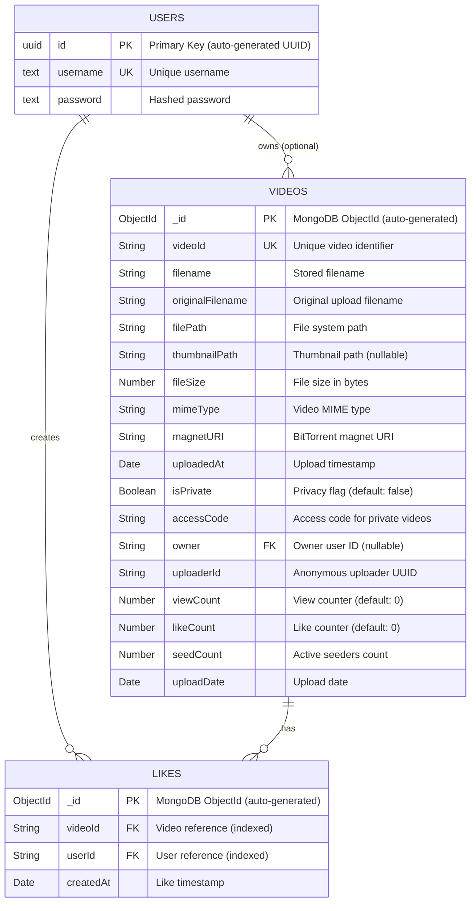

# PeerFlix - Entity Relationship Diagram

This project uses a hybrid database architecture:
- **PostgreSQL** (via Drizzle ORM) for user authentication
- **MongoDB** (via Mongoose) for video metadata and likes

## ER Diagram

## Database Details

### PostgreSQL (Users)
- **Table**: `users`
- **ORM**: Drizzle ORM
- **Purpose**: User authentication and account management

### MongoDB (Videos & Likes)
- **Collections**: `videos`, `likes`
- **ODM**: Mongoose
- **Purpose**: Video metadata, P2P streaming info, and user interactions

## Relationships

1. **USERS → VIDEOS** (One-to-Many, Optional)
   - A user can own multiple videos
   - Videos can exist without an owner (legacy/anonymous uploads)
   - Foreign Key: `videos.owner` references `users.id`

2. **USERS → LIKES** (One-to-Many)
   - A user can create multiple likes
   - Foreign Key: `likes.userId` references `users.id`

3. **VIDEOS → LIKES** (One-to-Many)
   - A video can have multiple likes
   - Foreign Key: `likes.videoId` references `videos.videoId`

## Indexes

### Videos Collection
- `videoId`: Unique index

### Likes Collection
- `videoId`: Single field index
- `userId`: Single field index
- `(videoId, userId)`: Compound unique index (prevents duplicate likes)

## Key Features

### Privacy Controls
- Videos can be marked as private (`isPrivate` boolean)
- Private videos require an `accessCode` for access
- Access codes are automatically generated using crypto

### P2P Streaming
- Each video has a `magnetURI` for BitTorrent-based streaming
- `seedCount` tracks active peers sharing the video
- `uploaderId` provides anonymous uploader tracking

### Engagement Metrics
- `viewCount`: Number of video views
- `likeCount`: Number of likes (denormalized from Likes collection)
- Likes are tracked per-user to prevent duplicates
