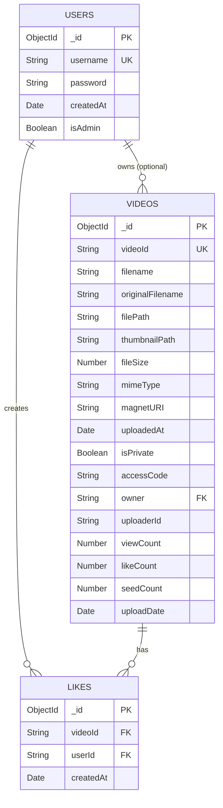

# PeerFlix – ER Diagram README

A guide to understanding the data model and recreating the Entity-Relationship (ER) Diagram for the PeerFlix P2P video streaming application.

---

## Table of Contents

- [Architecture Overview](#architecture-overview)
- [Entities](#entities)
  - [User](#1-user-mongodb)
  - [Video](#2-video-mongodb)
  - [Like](#3-like-mongodb)
- [Relationships](#relationships)
- [ER Diagram (Mermaid)](#er-diagram-mermaid)
- [Indexes](#indexes)
- [How to View the Diagram](#how-to-view-the-diagram)
- [How to Regenerate the Diagram](#how-to-regenerate-the-diagram)

---

## Architecture Overview

PeerFlix uses a **single MongoDB** database (via Mongoose ODM) for all three entities:

| Collection | Purpose                                   |
|------------|-------------------------------------------|
| `users`    | User accounts, authentication, roles      |
| `videos`   | Video metadata, P2P streaming info        |
| `likes`    | Per-user like records (many-to-many join) |

> **Note:** An older version of the schema used PostgreSQL (via Drizzle ORM) for users. The current backend (`P2PBackend`) uses MongoDB for all collections.

---

## Entities

### 1. User (`MongoDB`)

**Model file:** [`P2PBackend/models/userModel.js`](./P2PBackend/models/userModel.js)

| Field       | Type    | Constraints                        | Description                          |
|-------------|---------|------------------------------------|--------------------------------------|
| `_id`       | ObjectId| PK, auto-generated                 | MongoDB document ID                  |
| `username`  | String  | Required, Unique, 3–20 chars, lowercase | Unique username                 |
| `password`  | String  | Required, min 6 chars              | Bcrypt-hashed password               |
| `createdAt` | Date    | Default: `Date.now`                | Account creation timestamp           |
| `isAdmin`   | Boolean | Default: `false`                   | Admin privilege flag                 |

**Model hooks & methods:**
- `pre('save')` – Automatically hashes the password using bcrypt (salt rounds: 10)
- `comparePassword(candidate)` – Compares a plain-text password against the stored hash
- `generateAuthToken()` – Returns a signed JWT (expires in 7 days)

---

### 2. Video (`MongoDB`)

**Model file:** [`P2PBackend/models/videoModel.js`](./P2PBackend/models/videoModel.js)

| Field              | Type    | Constraints              | Description                                  |
|--------------------|---------|--------------------------|----------------------------------------------|
| `_id`              | ObjectId| PK, auto-generated       | MongoDB document ID                          |
| `videoId`          | String  | Required, Unique         | Application-level unique video identifier    |
| `filename`         | String  | Required                 | Stored filename on disk                      |
| `originalFilename` | String  | Required                 | Original name from the uploader's device     |
| `filePath`         | String  | Required                 | Absolute/relative path on the server         |
| `thumbnailPath`    | String  | Default: `null`          | Path to generated thumbnail image            |
| `fileSize`         | Number  | Required                 | File size in bytes                           |
| `mimeType`         | String  | Required                 | e.g. `video/mp4`                             |
| `magnetURI`        | String  | Required                 | BitTorrent magnet link for P2P sharing       |
| `uploadedAt`       | Date    | Default: `Date.now`      | Timestamp of upload                          |
| `isPrivate`        | Boolean | Default: `false`         | Whether the video is private                 |
| `accessCode`       | String  | Default: `null`          | 16-char hex code for private video access    |
| `owner`            | String  | Default: `null`          | FK → `users._id` (nullable for anonymous)   |
| `uploaderId`       | String  | Default: `null`          | Anonymous uploader UUID                      |
| `viewCount`        | Number  | Default: `0`             | Total number of views                        |
| `likeCount`        | Number  | Default: `0`             | Denormalized like count                      |
| `seedCount`        | Number  | Default: `0`             | Active WebTorrent seeders count              |
| `uploadDate`       | Date    | Default: `Date.now`      | Alias of `uploadedAt`                        |

**Model methods:**
- `generateAccessCode()` – Creates a random 16-char hex access code for private videos
- `validateAccessCode(code)` – Returns `true` if video is public, or if code matches

---

### 3. Like (`MongoDB`)

**Model file:** [`P2PBackend/models/likeModel.js`](./P2PBackend/models/likeModel.js)

| Field       | Type    | Constraints              | Description                        |
|-------------|---------|--------------------------|------------------------------------|
| `_id`       | ObjectId| PK, auto-generated       | MongoDB document ID                |
| `videoId`   | String  | Required, Indexed        | FK → `videos.videoId`             |
| `userId`    | String  | Required, Indexed        | FK → `users._id`                  |
| `createdAt` | Date    | Default: `Date.now`      | Timestamp of the like              |

---

## Relationships

```
USERS  ──< VIDEOS   (One-to-Many, optional — owner field may be null)
USERS  ──< LIKES    (One-to-Many)
VIDEOS ──< LIKES    (One-to-Many)
```

| Relationship         | Cardinality | FK Field          | Notes                                              |
|----------------------|-------------|-------------------|----------------------------------------------------|
| User → Videos        | 1 : 0..*    | `videos.owner`    | A user can own many videos; owner is nullable      |
| User → Likes         | 1 : 0..*    | `likes.userId`    | A user can like many videos                        |
| Video → Likes        | 1 : 0..*    | `likes.videoId`   | A video can be liked by many users                 |
| User ↔ Video (Likes) | M : N       | via `likes`       | Compound unique index prevents duplicate likes     |

---

## ER Diagram (Mermaid)

The full diagram is in [`ER_DIAGRAM.md`](./ER_DIAGRAM.md). It can be rendered in any Mermaid-compatible viewer.



---

## Indexes

### `videos` collection

| Field     | Type   | Purpose                    |
|-----------|--------|----------------------------|
| `videoId` | Unique | Fast lookup by video ID    |

### `likes` collection

| Field(s)            | Type            | Purpose                                    |
|---------------------|-----------------|--------------------------------------------|
| `videoId`           | Single          | Fast lookup of all likes for a video       |
| `userId`            | Single          | Fast lookup of all likes by a user         |
| `(videoId, userId)` | Compound Unique | Prevents a user from liking a video twice  |

---

## How to View the Diagram

### Option 1 – VS Code Extension
Install the [Markdown Preview Mermaid Support](https://marketplace.visualstudio.com/items?itemName=bierner.markdown-mermaid) extension, then open `ER_DIAGRAM.md` and press `Ctrl+Shift+V`.

### Option 2 – GitHub
Push the file to GitHub — Mermaid diagrams in `.md` files are rendered automatically.

### Option 3 – Mermaid Live Editor
1. Go to [https://mermaid.live](https://mermaid.live)
2. Paste the `erDiagram` block from `ER_DIAGRAM.md`
3. The diagram will render in real time
4. Export as SVG or PNG if needed

### Option 4 – CLI (`mmdc`)
```bash
# Install the Mermaid CLI
npm install -g @mermaid-js/mermaid-cli

# Render to PNG
mmdc -i ER_DIAGRAM.md -o er_diagram.png

# Render to SVG
mmdc -i ER_DIAGRAM.md -o er_diagram.svg
```

---

## How to Regenerate the Diagram

If the schema changes, update `ER_DIAGRAM.md` by following these steps:

1. **Identify changed models** in `P2PBackend/models/`
2. **Add/remove fields** in the `erDiagram` block inside `ER_DIAGRAM.md`
3. **Update relationship lines** if new collections are added
4. **Update the index table** in `ER_DIAGRAM.md` and this README if new indexes are defined
5. **Re-render** using one of the methods above to verify the diagram is valid

### Field type reference for Mermaid `erDiagram`

| Mongoose Type | Mermaid Type |
|---------------|--------------|
| `String`      | `String`     |
| `Number`      | `Number`     |
| `Boolean`     | `Boolean`    |
| `Date`        | `Date`       |
| `ObjectId`    | `ObjectId`   |
| `Array`       | `Array`      |

### Relationship notation reference

| Symbol  | Meaning              |
|---------|----------------------|
| `\|\|`  | Exactly one          |
| `\|o`   | Zero or one          |
| `}o`    | Zero or more         |
| `}\{`   | One or more          |
